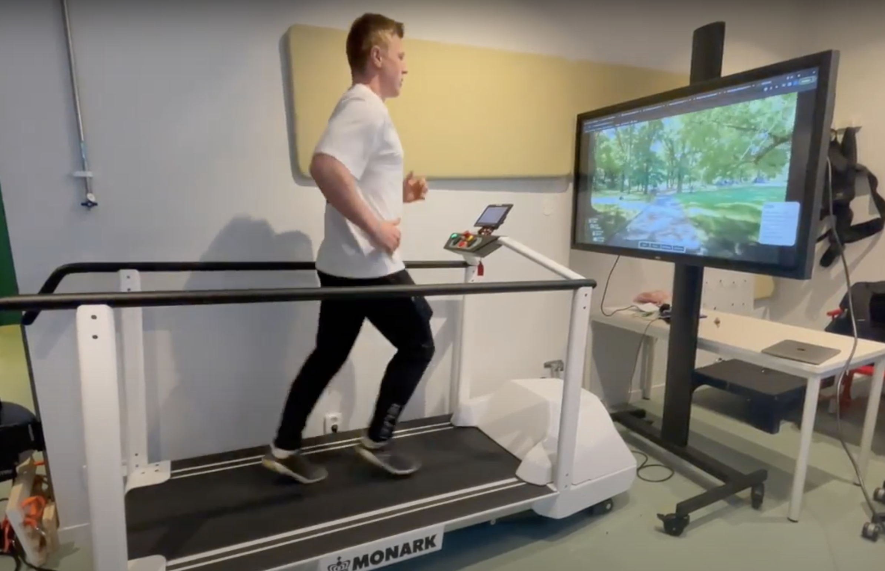
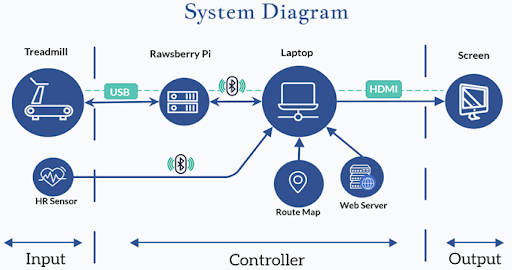

# ProCardio - Running throug Central Park

This repository has all the code and data concerning the Treadmill project for HL2032/HE1040/HL2041 HT22 Medical Engineering, Project Course, Autumn 2022.

# The Project
This is a software that allows you to run on a treadmill and experience a real time elevation and video speed changes.
The system records your runs and you can view your statistics on the run and other data.

Here is the software in use.

The main parts of our system are the Monark treadmill, TV screen, raspberry pi computer and a laptop, but you can read more about it in our [Final Paper](https://github.com/asmundur31/ProCardio/blob/main/FinalPaperTreadmill.pdf)

Also our [Final Presentation](https://github.com/asmundur31/ProCardio/blob/main/ProCardioFinalPresentation.pdf)

# Get started - Installation
To use the software, it can be done in two ways.
1. run it by visiting [ProCardio](https://treadmill.dev.kthcloud.com/home) the website
2. run it on localhost

## 1. Run it through link
We have deployed our code to the KTH Cloud in collabiration with other students Bachelors project. You can visit [the website](https://treadmill.dev.kthcloud.com/home) where you can run the existing routes and tests. There you can also take a look at previous recordings.

## 2. Run it on localhost
To be able to run it locally a few things need to be configured.

You need to make sure you have (the links provided are good sources to help you get started)
1. Git installed. ([Git](https://github.com/git-guides/install-git))
2. Node package manager (NPM) installed. ([Node and npm](https://docs.npmjs.com/downloading-and-installing-node-js-and-npm))
3. Postgres database server setup on your computer. ([PostgreSQL](https://www.postgresql.org/docs/current/tutorial-install.html))
4. Create a database on that server (can be what ever you whant). ([Create a database](https://www.postgresql.org/docs/current/sql-createdatabase.html))
5. .env file for environmental variables

        PORT=3000
        CLOUDINARY_URL=... Here we used a cloudinary service
        DATABASE_URL=postgresql://<Username>:<Password>@localhost:5432/<DatabaseName>
6. Optional cloudinary service [Cloudinary](https://cloudinary.com/).

We used the cloudinary service to host our images and videos. You can also skip it but then you need to make sure you reference the images and videos correctly in the code.

The cloudinary service is free (at least in december 2022).

**When you have all these things you can continue here.**

1. Clone/Download this repository on to your computer, wherever you whant.
        
        cd .../your-path/
        git clone https://github.com/asmundur31/ProCardio
2. Now go into the project by performing

        cd ProCardio
3. Install all dependencies by performing

        npm install
4. Setup the database (create tables and setting some data)

        npm run setup
5. Run the program in development mode

        npm run dev
6. or in production mode

        npm run prod

# Execution of code
After you have downloaded everything you are ready to run the code. Here is a system diagram that can help you understand how different parts of the system talk together.

One assumption that the software makes is that the treadmill can go from -10% to 10% incline. So what we did is that we added tree bricks under the backside of the treadmill.

All these components need to be connected before execution.

1. Wired connections
    * The rawsberry pi computer needs to be connected to the treadmill and running code called TreadmillService that a group from last year (2021) created. This code is written in python and impements BLE protocol.
      * Sometimes the code crashes and does not work. Then you need to restart the treadmill.
    * The laptop needs to be connected to a screen

2. Wireless connections (all happens within software)
    * When the software is running then the bluetooth connections are made.
    * Connect laptop with treadmill through the rawsberry pi computer (within software).
    * More sensors that have bluetooth protocol (for example heart rate sensor) (within software).

Now your code should be working.
# Add a new route/test

How we added the routes/test was that we found a running video on [Youtube](https://www.youtube.com/) and collected a elevation data from Google Earth from the same routes as in the video.

The elevation data files look like:

        {
          "name": "Park Run",
          "type": "route",
          "route": "/static/routes/ParkRun.geojson", <-- Link to self
          "video": "https://res.cloudinary.com/dwqpirk6g/video/upload/v1666974731/Treadmill/ParkRunSmall_wdbj1f.mp4",
          "thumbnail": "https://res.cloudinary.com/dwqpirk6g/image/upload/v1666974741/Treadmill/ParkRun_qnmwvr.png",
          "description": "Very nice and cosy run in Central Park.",
          "features": [
            {
              "type": "Feature",
              "properties": {
                "track_fid": 0,
                "track_seg_id": 0,
                "track_seg_point_id": 0,
                "ele": 32.503
              },
              "geometry": {
                "type": "Point",
                "coordinates": [
                  -73.957159792,
                  40.797959496
                ]
              }
            },
            more features...
          ]
        }
Where we have a link to the video, link to the thumbnail and a link to the route/test (link to itself).
This applies both for the routes and tests.

You need to add this file to either
                
        ./static/routes
        or
        ./static/tests

For video we used the cloudinary service, but it could be anywhere.

# Recordings

Each recording consists of data from connected bluetooth devices and the calculated route.
That is 
* Experiment data (general info)
* Treadmill data
* Heartrate data
* Route data (calculated from real scene)

Example of a recording, where the treadmill was connected and heart rate monitor:

        {
          "experiment": {
            "fileName": "recording_ParkRun_route_4e5fcf32-f990-4e9c-ab26-d5cde56d438f",
            "name": "Park Run",
            "type": "route",
            "duration": 94054,
            "startTime": 1670849896007,
            "endTime": 1670849990061,
            "devices": {
              "treadmill": "raspberrypi",
              "hr": "Polar Sense B37AD727"
            }
          },
          "treadmill": {
            "device": "raspberrypi",
            "measurements": {
              "FTMS": [
                {
                  "speed": "0.0",
                  "inclination": "0.0",
                  "distance": 320,
                  "duration": 1212000,
                  "prettyDuration": "00:20:12",
                  "time": 1670849896803,
                  "measurementType": "FTMS"
                },
                ... more treadmill data
              ]
            }
          },
          "hr": {
            "device": "Polar Sense B37AD727",
            "measurements": {
              "HR": [
                {
                  "heartRate": 74,
                  "time": 1670849896504,
                  "measurementType": "HR"
                },
                ... more heart rate data
              ]
            }
          },
          "routeData": {
            "dataPoints": [
              {
                "timestamp": 1670849899040,
                "incline": -0.08258660419546235,
                "elevation": 32.502663595304725,
                "currentDistance": 0.40733566727484516
              },
              ... more route data
            ]
          }
        }

# Future improvements (ideas)

Here we list a few ideas we had that we wanted to do but did not have time to do.

## More detailed data analysis
* Do more analytics on the data in the recording section.
* Better overlay of data on video, could maybe include some graphs that update in real time.

## Software controls
* Make it possible for user to control the software from the treadmill. At the moment users need to run between the treadmill and the laptop to start a route.

## Creating a new route
* Create a software that makes it easier to create a new route.
  * could be an mobile application that collects the elevation points and a GoPro camera to record the video. After the run is done then a user can upload the video to the app and it can be attached to the route data.
  * Then people can choose between running from home or create a new route that later they or anyone can run.

## Tutorial
* Create a short video tutorial of how to use the software, apply it to any treadmill.

## Raspberry pi
* Can we simplify the connection with the treadmill? At the moment the raspberry pi computer works as an BLE connection.
* Skip the raspberry pi computer and have a wired connection between the laptop and treadmill.

## Login system
* Allow users to create an account and have all their sessions/runs only available for them.

## Implement tests
* Fireman test
* Police test
* Parkinsons test
* Pshycological test 
  * The idea is to see if the heart rate will increase sooner if a person can see the struggles comming or not.
  * That is does the body use visual data to prepear for phisical struggles.

  

